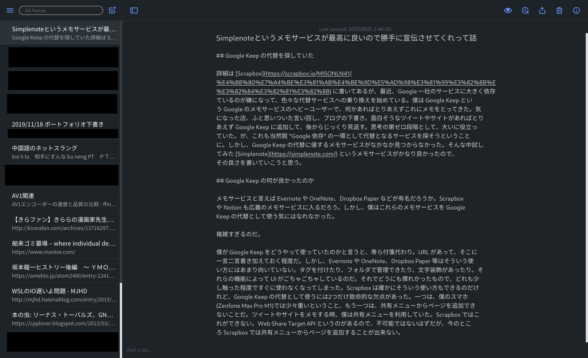
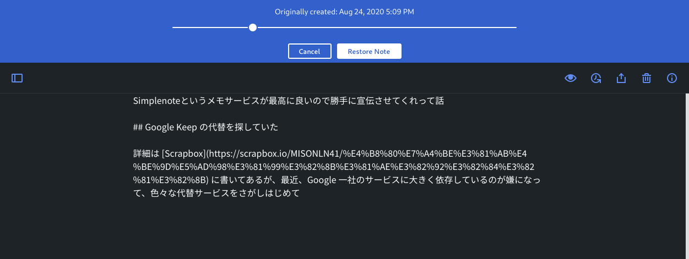
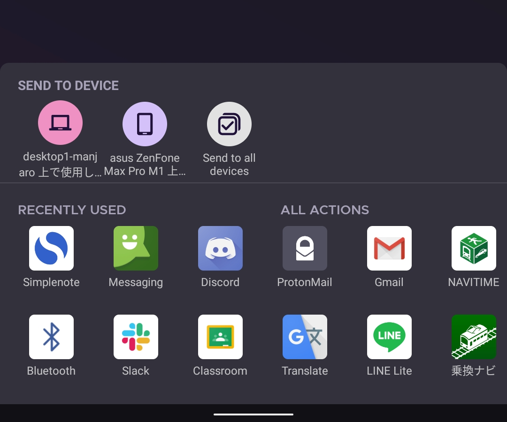

## Google Keep の代替を探していた

詳細は [Scrapbox](https://scrapbox.io/MISONLN41/%E4%B8%80%E7%A4%BE%E3%81%AB%E4%BE%9D%E5%AD%98%E3%81%99%E3%82%8B%E3%81%AE%E3%82%92%E3%82%84%E3%82%81%E3%82%8B) に書いてあるが、最近、Google 一社のサービスに大きく依存しているのが嫌になって、色々な代替サービスへの乗り換えを始めている。僕は Google Keep という Google のメモサービスのヘビーユーザーで、何かあればとりあえずこれにメモをとってきた。気になった店、ふと思いついた言い回し、ブログの下書き。面白そうなツイートや Web サイトがあればとりあえず Google Keep に追加して、後からじっくり見返す。思考の第ゼロ段階として、大いに役立っていた。が、これも当然脱 "Google 依存" の一環として代替となるサービスを探そうということに。しかし、Google Keep の代替に値するメモサービスがなかなか見つからなかった。そんな中試してみた [Simplenote](https://simplenote.com/) というメモサービスがかなり良かったので、その良さを書いていこうと思う。

## Google Keep の何が良かったのか

メモサービスと言えば Evernote や OneNote、Dropbox Paper などが有名だろうか。Scrapbox や Notion も広義のメモサービスに入るだろう。しかし、僕はこれらのメモサービスを Google Keep の代替として使う気にはなれなかった。

複雑すぎるのだ。

僕が Google Keep をどうやって使っていたのかと言うと、専ら付箋代わり。一言二言の短い書き込みに、URL を貼ったりする程度だ。しかし、Evernote や OneNote、Dropbox Paper 等はそういう使い方にはあまり向いていない。タグを付けたり、フォルダで管理できたり、文字装飾があったり。それらの機能によって UI がごちゃごちゃしているのだ。それがどうにも慣れかったので、どれも少し触った程度ですぐに使わなくなってしまった。Scrapbox は確かに付箋代わりのような使い方もできるのだけれど、Google Keep の代替として使うには 2 つだけ致命的な欠点があった。一つは、僕のスマホ(Zenfone Max Pro M1)では少々重いということ、もう一つは、共有メニューからページを追加できないことだ。ツイートや Web サイトをメモする時、僕は共有メニューを利用していた。Scrapbox ではこれができない。Web Share Target API というのがあるので、不可能ではないはずだが、今のところ Scrapbox では共有メニューからページを追加することが出来ない。

## Simplenote を知る

そんな感じだったものだから、メモアプリは Google Keep を使い続けるしかないかなあ... という気分にもなっていた。しかし、そんな中偶然見つけたのが、"Simplenote" だ。正直なところあまり期待していなかったのだが、とりあえず試してみることにした。

## その名の通り超シンプル

とりあえず登録してみて、画面を見て感じたのが、とてもシンプルな作りになっているということ。何処にどの機能があるのかがすぐに分かる。Web 版は 2 カラム構成になっていて、左にメモ一覧、右にメモの本文が表示されるようになっている。入力すればリアルタイムに保存される。同期は早く、スマホと Web 版で同時に開いて編集してみても、せいぜい 2、3 秒で同期される (が、編集中に両方開いておくと同期のコンフリクトが起きて入力した文が壊れる場合があった)。検索は素早く、全文検索が可能だ。そして、タグ管理ができる。僕はメモにタグ付けはあまりしようと思わないが、タグを設定するテキストボックス (?) がページ下部に目立たない感じで配置してあるので、「無駄な機能でごちゃごちゃしている」といった印象は全くない。こういう、主張しない UI というのもまたシンプルな感じで良い。

## 気の利いた便利機能

Simplenote はただシンプルなだけでなく、気の利いた機能がいくつもある。例えば、字数カウントと語数カウント。ブログの下書きを書いている時など、どれぐらい文字を書いたのかがすぐに分かるのは便利だ。そして、History 機能。これを使うとメモの上部にスライダーが表示され、それ以前のメモの履歴を確認することが出来る。Scrapbox にある Page History と同じような機能だ。内容を大幅に書き換えた後からでも、書き換える前の状態を復元できるというのはなかなか便利なのではないだろうか。そして一部の人が目を輝かせて喜びそうな機能として、Markdown への対応がある。メモの Info から Markdown のオプションを有効化すると、そのメモの Markdown プレビューを利用することが可能になる。プレビューが使えるというだけなのですごく便利かと言ったら微妙だが、自分が書いた Markdown が間違っていないか、のチェックぐらいには使えるだろう。他にもメモの共有リンクの作成や共同編集、ダークモードへの対応などもある。

## 共有メニューから追加できる

Simplenote にはアプリ版もある。僕がアプリ版に求める最も重要な条件として、共有メニューからメモを追加できるか、ということがあるのだが、これもちゃんとできた。よかった。これなら気になるサイトやツイートを心置きなくどんどん追加できる。

## Google Keep と比べて劣っている面

画像を追加できない、リマインダーを設定できない、メモの背景色を設定できない、など。僕はどの機能もまともに使ったことがないので全く困らなかった。

## 総括

クセの無い、とてもシンプルなメモサービスで大変気に入った。先ほど Google Keep にあったメモを全部移し終えたところ。これからは、メモにはこの Simplenote を使っていこうと思う。ちなみに、 `Ctrl + クリック` でリンクを開くために、[Beta 版](https://staging.simplenote.com/) を利用している。

今のメモサービスの機能を使い切れていないな、と感じる人はぜひ試してみてほしい。この、潔いシンプルさがきっと気に入るはずだ。
