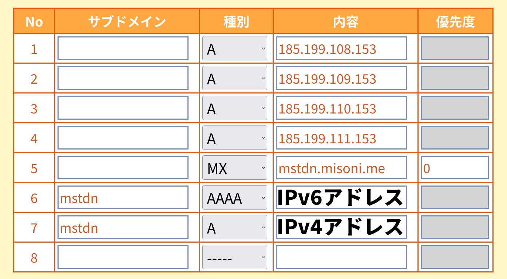

---
title: "Mastodon を ConoHa VPS の Arch Linux にインストールする"
date: "2020-10-04"
description: ""
tags: ["Mastodon", "VPS", "GNU/Linux"]
--- 

いつものごとく突発的な思いつきで、自分用の Mastodon インスタンスを建てようと思い VPS を借りた。基本的には公式のガイドに沿ってるだけなのだが、Arch Linux で建てましたという日本語の記録はあまり見かけなかったので記しておく。

## 構成
- ConoHa VPS の 1GB プラン
- Arch Linux (サーバー作成時に選べるイメージを使用)
- ムームードメインで取得したドメインのサブドメインで運用 ( [mstdn.misoni.me](https://mstdn.misoni.me) )
- Mastodon 3.2.0
- メールサーバーは**用意しない** (一人用なので要らないと考えた)

## DNS の設定



ムームー DNS 側でサブドメインを切り、VPS の IP アドレスを指定する。AAAA レコードには IPv6 アドレスを、A レコードには IPv4 アドレスを入れる。まあ、ここの情報は山のようにあるので各自で頑張ってくれ。

## VPS自体の初期設定

SSH 接続して作業用ユーザーを作成して sudo の設定をして root ログインを無効化して公開鍵認証にしてパスワードログインを無効化した。こちらも情報は山のようにあるので各自で頑張ってくれ。

## 必要なパッケージの入手

Mastodon を動かすのに必要なパッケージをインストールする。

```bash
sudo pacman -Syu
sudo pacman -S base-devel ffmpeg imagemagick libidn libpqxx libxml2 libxslt libyaml nodejs postgresql protobuf redis yarn zlib git nginx certbot-nginx
```

Ruby はバージョンを指定してインストールする必要があるため、rbenv というツールを利用する。これは pyenv の Ruby 版みたいなものだ。`.bashrc` の設定なども必要になるため、この時点で `mastodon` というユーザーを作成する。

```bash
sudo useradd --create-home mastodon
```

作成したら、ユーザーを `mastodon` に切り替える。

```bash
sudo su - mastodon
```

`rbenv` と `rbenv-build` を導入する。

```bash
git clone https://github.com/rbenv/rbenv.git ~/.rbenv
cd ~/.rbenv && src/configure && make -C src
echo 'export PATH="$HOME/.rbenv/bin:$PATH"' >> ~/.bashrc
echo 'eval "$(rbenv init -)"' >> ~/.bashrc
exec bash
git clone https://github.com/rbenv/ruby-build.git ~/.rbenv/plugins/ruby-build
```

ここまで完了したら、Ruby 2.6.6 をインストールする。`Installing Ruby 2.6.6...`みたいな表示のまま結構時間がかかるが、フリーズしているわけではない。

```bash
RUBY_CONFIGURE_OPTS=--with-jemalloc rbenv install 2.6.6
rbenv global 2.6.6
```

`ruby-bundler`もインストールする。

```bash
gem install bundler --no-document
```

終わったら一旦 `mastodon` から離脱する。

```bash
exit
```

## PostgreSQL と Redis の設定

PostgreSQL のデータベースを初期化し、PostgreSQL と Redis のサービスを有効化する。何やってるのか理解してない。

```bash
sudo su - postgres -c "initdb --locale en_US.UTF-8 -D '/var/lib/postgres/data'"
sudo systemctl enable --now postgresql redis
```

次に、PostgreSQL に Linux 側のユーザー名と同じ `mastodon` という名前のユーザーを作成する。

```bash
sudo su - postgres -s /bin/sh -c "createuser -d mastodon"
```

以上で PostgreSQL と Redis の設定は終わり。

## Mastodon のセットアップ

AUR にも Mastodon が置いてあるのだが、バージョンが 3.1.4 と少し古かったので普通に GitHub から clone した。

`git` を利用して Mastodon をダウンロードし、安定版リリースを checkout する。

```bash
git clone https://github.com/tootsuite/mastodon.git live && cd live
git checkout $(git tag -l | grep -v 'rc[0-9]*$' | sort -V | tail -n 1)
```

Ruby と JavaScript 関連の依存関係にあるパッケージをインストールする。

```bash
bundle config deployment 'true'
bundle config without 'development test'
bundle install -j$(getconf _NPROCESSORS_ONLN)
yarn install --pure-lockfile
```

Mastodon のセットアップウィザートを立ち上げる。

```bash
RAILS_ENV=production bundle exec rake mastodon:setup
```

これはウィザードに従っていれば簡単に完了する。ドメインや、クラウドストレージ ( S3とか ) 利用の可否、メールサーバーの設定等が対話形式で進んでいく。今回は自分専用のインスタンスなので、メールサーバーの設定は全て空欄で押し通した。

最後に admin アカウントの設定ができるが、その際に非常に長いパスワードが生成される。忘れると再びセットアップをやり直さなければいけないと思われるので、何かしらの方法で控えておくことを推奨する。

以上で Mastodon 本体のセットアップは完了である。ユーザー `mastodon` から離脱する。

## nginx の設定

最後に nginx の設定をする。

まず、`certbot` を利用して SSL 証明書を発行する。

```bash
sudo certbot --nginx -d mstdn.misoni.me
```

適当に進めていけばいい。意識他界系なので "メールアドレスをどっかの調査会社と共有" みたいなやつは拒否した。意識他界系なので。

デフォルトの config ファイルを `sites-available` にコピーし、`sites-enabled` にシンボリックリンクを張る。

```bash
cd /etc/nginx
sudo mkdir sites-available sites-enabled
sudo cp /home/mastodon/live/dist/nginx.conf sites-available/mastodon
sudo ln -s sites-available/mastodon sites-enabled/mastodon
```

`/etc/nginx/sites-enabled/mastodon` 内の `example.com` を**全て**自身のドメインに置き換える。今回は `mstdn.misoni.me` に置き換えた。

```bash
sudo sed sites-available/mastodon -e 's/example\.com/mstdn\.misoni\.me/g'
```

としてもいいし、エディタで書き換えてもいい。

また、SSL を有効化するために `ssl_certificate` と `ssl_certificate_key` の行をアンコメントする。

`nginx.conf` の `http {...}` ブロックの末尾に `include /etc/nginx/sites-enabled/*;` を追記し、`site-enabled/` 下のファイルを読むようにする。

設定が終わったら nginx サービスを立ち上げる。

```bash
sudo systemctl enable --now mastodon
```

## systemd サービスの設定

いよいよ最後のステップ。Mastodon の systemd テンプレートをシステムにコピーする。

```bash
sudo cp /home/mastodon/live/dist/mastodon-web.service /etc/systemd/system/
sudo cp /home/mastodon/live/dist/mastodon-sidekiq.service /etc/systemd/system/
sudo cp /home/mastodon/live/dist/mastodon-streaming.service /etc/systemd/system/
```

そしてサービスを起動。

```bash
sudo systemctl daemon-reload
sudo systemctl enable --now mastodon-web mastodon-sidekiq mastodon-streaming
```

はい、お疲れさま。

## トラブルシューティング

### nginx が `# nginx: [emerg] bind() to 0.0.0.0:80 failed (98: Address already in use)` と表示されて起動しない

80番ポートを占領されているらしい。

`lsof` というツールを使って80番ポートを使っているプロセスを調べる。lsof は pacman からインストールできる。

```bash
sudo pacman -S lsof
sudo lsof -i:80

COMMAND PID USER FD TYPE DEVICE SIZE/OFF NODE NAME  
nginx 22964 root 4u IPv4 21601 0t0 TCP *:http (LISTEN)  
nginx 22965 nginx 4u IPv4 21601 0t0 TCP *:http (LISTEN)  
```

nginx が既に立ち上がっていたのか、nginx 自身が80番ポートを使っていたらしい。lsof 使用時に pid も表示されるので、pid を指定して kill して、もう一度 nginx を立ち上げる。

```bash
sudo kill 22964
sudo systemctl start nginx
```

### 静的ファイルが全部 404 になる

権限の問題かもしれないし、単に再起動したから直ったのかもしれないが、下記のコマンドで動くようになった。このコマンドが正しいのかもセキュリティ的に大丈夫なのかも、ぜんぜんわからない。俺は雰囲気で Arch をやっている。

```bash
sudo chmod +x /home/mastodon/live/public/
sudo chmod +x /home/mastodon/
sudo reboot
```

間違い等あったら Twitter か Discord、もしくは Mastodon で教えていただけると助かる。では。

## 参考

- [Run a Mastodon Server on Arch Linux VPS | LIOLOG](https://liolok.github.io/Run-a-Mastodon-Server-on-Arch-Linux-VPS/)
- [Installing from source - Mastodon documentation](https://docs.joinmastodon.org/admin/install/)
- [Fedra 30に nginxをインストール・設定 - Qiita](https://qiita.com/Sue_chan/items/fb9fc616efe5bf1b30b4)
- [nginx: [emerg] bind() to 0.0.0.0:80 failed (98: Address already in use) | EasyRamble](https://easyramble.com/nginx-emerg-bind-failed.html)
