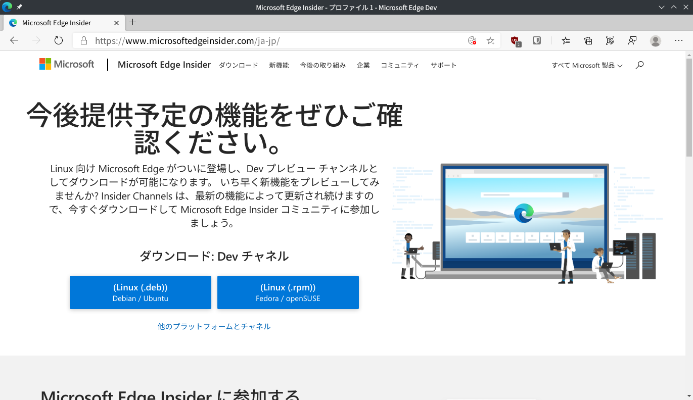
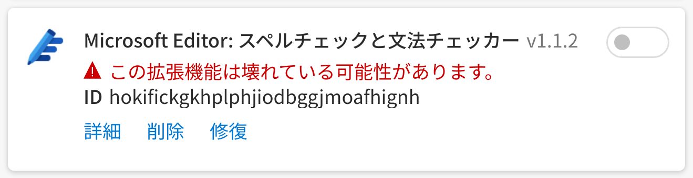

Linux 版 Microsoft Edge の Dev Channel が公開されたので軽く試してみた。ずっと前から [Microsoft Edge Insider](https://www.microsoftedgeinsider.com/ja-jp/) では Linux 版が “Comming Soon” となっていたし、Build 2020 では Ubuntu 上で動く Edge がチラ見せされたりしていたので結構楽しみにしていた。とは言え、前々から 10 月に出すという話は聞いていたので特に驚きなどはなく、予定通りに来ましたねという感じ。

公式にサポートされているのは Debian 系と Fedora 系 (と表記してしまっていいのだろうか? Fedora と openSUSE の関係を知らないのだが) のみなので、Arch Linux ベースの Manjaro にはそのままではインストールできない。とはいえ Debian 系向けのバイナリをちょっと細工するとほぼそのまま使えてしまう場合も多く、またそれを自動化するパッケージ (ソースからビルドするのでなく、バイナリをダウンロードして細工するタイプ) が AUR に転がっていることも多い。Edge も案の定、[AUR にパッケージが置いてあった](https://aur.archlinux.org/packages/microsoft-edge-dev-bin/)ので、ありがたく使わせてもらう。Arch は偉大なり。

実際に試してみた感想としては、「Edge だなあ。」という感じで、それ以上でもそれ以下でもない。ポップアップの影の描写が変だったりするけれど、そういう細かいバグに関しては Dev 版なので当たり前だ。プラットフォーム固有の機能が (しかも Windows じゃない OS に向けて) あるはずもなく、やっぱり「Edge だなあ。」と。AUR からインストールしたからなのかバグなのか知らないけど、Microsoft Editor の拡張機能が動かなかったことだけが残念。

とは言え Edge はコレクションやトラッキングブロック、縦タブのような独自機能でシンプル志向の Google Chrome と差別化を図っていて、しかも天下の Microsoft なので安定性も結構高い、かなりいい線を行ってるブラウザだと思っている。個人的に Microsoft の Fluent Design も好きだし、Edge が Linux で使えるようになったのは結構嬉しいといったところ。むしろ Edge が他の弱小 Chromium 系ブラウザや Firefox を食ってしまうんじゃないかと心配になるぐらいだ。それもまた仕方のないことなのかもしれないけれど。

とりあえず Arch にも公式で出してくれないかな〜
