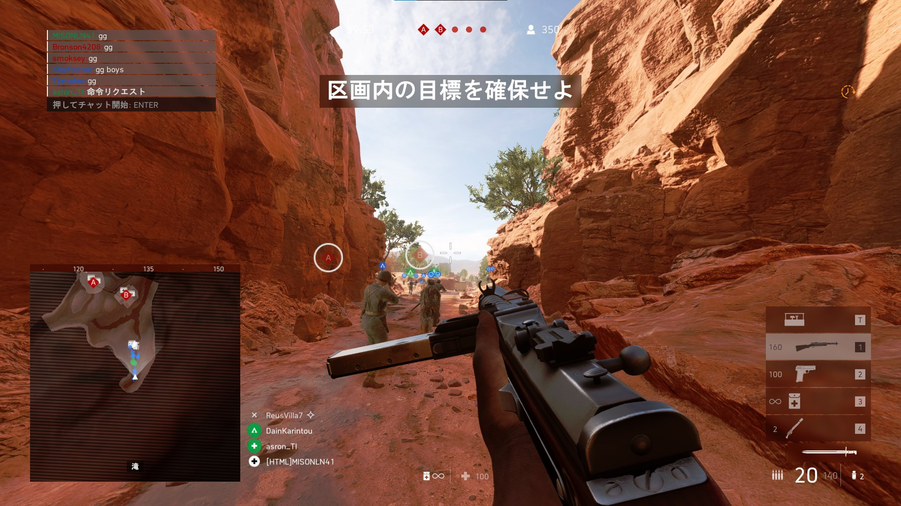
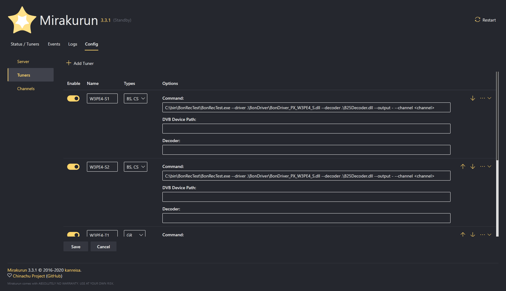

この投稿は [ジャンル無し 全部俺 Advent Calendar 2020](https://adventar.org/calendars/5495) の 2 日目の投稿です。

---

今年の 4 月頃から [Manjaro](https://manjaro.org/) という Linux ディストリビューションを使っていたのだけれど、先日 Windows に戻った。

理由は大きく分けて 3 つある。

1 つは、ゲームをやりたくなったこと。僕は [Battlefield](https://www.ea.com/ja-jp/games/battlefield) というシューティングゲームをプレイしていたのだけれど、Manjaro Linux に移行して以来、一切プレイしていなかった。Wine や DXVK を使って Manjaro 上で Battlefield をプレイすることも試したけれど、クラッシュしたり、プチフリが頻発したりしてとても遊べるレベルではなかった。そもそも Battlefield V を Windows 上で動かしていた時も常時 60fps を割っているようなよわよわ CPU なので仕方ない(GPU は RX580 なので FHD でプレイする分には十分なのだけれど...)。とはいえ、Battlefield をプレイしなくなってからも YouTube で動画を観たり、新着情報をチェックしてはいたのだが、やっぱりプレイしたいなあ、という気持ちが高まってしまった。昨日、実に 7 ヶ月ぶりに Battlefield V をプレイしたら、やっぱりとても楽しかった。相変わらず下手くそなんだけれど、美しいグラフィック、破壊表現、64 人対戦のわちゃわちゃ感と、全てが懐かしかった。Only in Battlefield がそこにはあった。相変わらずフレームレートは 60fps に遠く及ばないのだが。

> 新マップじゃん
> 
> Misoni (@MISONLN41) [December 1, 2020](https://twitter.com/MISONLN41/status/1333757967343108096)

↑ これは 6 月に実装されたマップを初めてプレイする人

2 つ目は、Manjaro + KDE の組み合わせが結構不安定だったこと。Linux デスクトップも今はすっかり成熟しているのだろうと思っていたのだが、どうやらその限りでもないらしい。僕には Web ブラウジング中にテキストを選択しては解除して、選択しては解除する...という謎の癖があるんだけど、Firefox で選択したテキストをちょっとドラッグしてから離すと、その直後の数秒間、異様に重くなる。Chromium はどうやらドラッグ中のテキストを独自描写しているようなのでこの問題は発生しないのだが、僕のメインブラウザは Firefox なので困ってしまった。変な癖と変なバグが変にかみ合って、最悪な状況になってしまっていた。他にも HDD 使用率が上がると異様に重くなってプチフリを繰り返すとか(これはカーネルを変更することで直ったのだが)、Linux で使えるファイルマネージャがどれも微妙だとか、色々とあった。

3 つ目は、Office が必要になったこと。これは単純に PowerPoint を使うことになったというだけだ。これも Wine でごにょごにょすれば不可能ではないらしいが、そんな綱渡りみたいなこともしたくない。折角 Windows のライセンスがあるのだから、Windows 上で Office を動かそう、という考えに至った。

そんな感じの理由で Windows に戻ったのだけれど、まあ Windows も完璧ではなかったり。相変わらず通知システムはクソだし、Fluent Design の導入は中途半端で Win32 コントロールはダサいし、ダークテーマも不完全だし、特に UI に関しては明らかに KDE のほうが優れていたと思う。

ただ、以前の Windows 環境と今回クリーンインストールした Windows 環境では構築方法をちょっと変えていて、少しだけ以前より快適に使えるようになった。

まず、[Chocolatey](https://chocolatey.org/) を導入したこと。Chocolatey は Windows 用のパッケージ管理ツールだ。Arch Linux ベースの Manjaro では pacman や AUR といったシステムを通じてほとんどのパッケージを管理できた。Chocolatey は、Windows において pacman のように CUI からパッケージ管理を可能にする便利なツールだ。似たようなものに Microsoft 公式の Windows Package Manager (winget) があるけれど、これはまだ開発中だったので、今回は Chocolatey を導入した。結論としては、大正解だった。今までバラバラな公式サイトからいちいちインストーラをダウンロードして Next をポチポチ押していたのがアホらしくなる。ありとあらゆるソフトをカバーしているという訳ではないけれど、メジャーなものは殆どそろっているだろう。非常に便利なのでオススメだ。

そしてもう 1 つは、DTV 環境を変えたこと。以前の Windows 環境では、DTV 環境に TVTest や EDCB (Material WebUI) を利用していたのだが、これはあまり「美しく」なかった。どれも Windows にべったり依存したソフトウェアだし、それぞれがうまく協調して動いているわけでもない。別に問題があったわけじゃないけれど、なんとなく気に食わなかった。Manjaro 上での DTV 環境では、EPGStation → Mirakurun → recpt1 + libarib25 → px4_drv といった感じで、非常にシンプルな主従関係に基づく構成になっていた。そこで、今回は Windows でも EPGStation や Mirakurun による美しい DTV 環境を構築しようと挑戦した。チャンネル設定に手こずったりはしたものの、いい感じの環境になった。今は EPGStation → Mirakurun → BonRecTest + B25Decoder → BonDriver → PLEX 公式ドライバという構成で、綺麗な主従関係に基づく美しい DTV 環境になっている。余談だが、Mirakurun の WebUI には Microsoft 謹製の Fluent UI が採用されていて、非常に美しい。EPGStation と違ってあまり触る機会がないのだけれど、美しいので定期的に WebUI にアクセスしている。

そんな感じで、ちょっとだけパワーアップした Windows 環境を手に入れましたとさ。めでたしめでたし。
