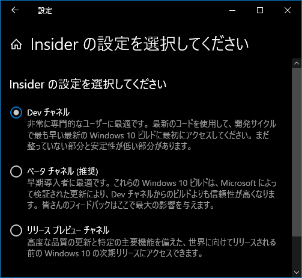

この投稿は [ジャンル無し 全部俺 Advent Calendar 2020](https://adventar.org/calendars/5495) の 12 日目の投稿です。

---

**キレそう。**自己責任なんだけど。

タイトルの通り、PC でテレビを視聴する環境が壊れてしまった。Windows Update をして再起動してからのことだ。

僕は Windows Insider Program というのに参加していて、これに入ると Insider Preview という開発中のビルドを導入することができる。これには Release Preview、Beta、Dev の 3 つのリングがあって、Release Preview がリリース直前のビルドが降ってくる一番安定したリング、Dev が一番新しいビルドが降ってくるリスク高めのリングだ。ちなみに一度 Dev リングに設定すると脱出法がクリーンインストールしかないらしい。は？

もちろん Release Preview でもリスクは伴うし、安定した環境を求めるならそもそも Insider Preview ビルドなんて導入するべきではないのだが。新しい物好きの僕は、何を思ったかこれを Dev リングに設定していた。で、「開発中のビルドの導入」と聞いてピンとくる人もいるだろうが、つまりこれは実質的に Windows の再インストールだ。一度 Windows のインストールファイルをすべて削除し、新しい Windows のファイルを導入し、デバイスの再構成をしている。

因みに普通の大型アップデート(19H2→20H1)も同じことをしているのだが、これは年に一回しかない。20H1→20H2 のような小規模アップデートなんかは再起動時にアップデートが走りこそすれど再インストールレベルのことはしていないし、Windows 10 の更新システムもこなれてきたもんだと思う。最も、Android や iOS の更新エクスペリエンスと見比べたら課題山積なのだが。ここら辺は 10X では大幅に改善されているという話も聞くが果たしてどうなのだろうか。10X といえば [Windows Latest](https://www.windowslatest.com/) だか [Windows Central](https://www.windowscentral.com/) で 10X は Win32 コンテナを実装しないままリリースされるなんて話を見かけた気がするのだが、あれは結局どうなったのだろう。正直、Win32 コンテナが無かったら Windows RT の二の舞になるような気がするのだけれど。Windows 10 on ARM は [x86 に加え x64 のエミュレーションにも対応](https://blogs.windows.com/windows-insider/2020/12/10/introducing-x64-emulation-in-preview-for-windows-10-on-arm-pcs-to-the-windows-insider-program/)(まだ Insider Preview 段階だが)し、Surface Pro X やその他 WoA 端末は活用の幅が広がりそうな気がするのだが、x64 CPU を積むであろうと言われている Surface Neo でそもそも Win32 アプリケーションが全く動かなかったらとんだお笑い種だ。10X はアプリの実行環境をコンテナに隔離したり OS のモジュール化が進んでいたり(WCOS 絡み?)と非常に面白い OS だけに、ぜひとも一般市場にも受け入れられやすい形に整えてから出してほしいなと思う。こういう期待を華麗に裏切っていくのが Microsoft なのだが(?)

閑話休題。

今朝、先述の通り Dev リングに設定していた僕の PC に [Build 21277](https://blogs.windows.com/windows-insider/2020/12/10/announcing-windows-10-insider-preview-build-21277/) が降ってきたので更新した。長い長いインストールが終わり、いくつかの新機能が使えるようになった。その時は EPGStation のサービスが自動起動していないことに気付き、サービスの管理画面から手動で起動した。起動した EPGStation の画面にはいつも通りの録画リストと予約リストが映っていた...だが。

異変に気付いたのは、ごちうさが放送開始するちょっと前だ。一週間のご褒美、至上の 30 分を心待ちに EPGStation から BS11 のストリームを開いたのだが、そこに表示されたのは真っ暗な画面であった。いや、OLED ディスプレイじゃなくて普通の液晶ディスプレイなので真っ暗と言ったら嘘になるのだが。

正直、この時点ではあまり焦っていなかった。とりあえず EPGStation と Mirakurun の Config を確認して、再起動。

ところが、それでも映らない。Mirakurun の WebUI を確認すると Active と Standby が高速で切り替わりながらエラーを吐き出していた。時刻は既にごちうさ放送開始の 2 分前だった。

「あれ、もしかしてこれマズいパターンでは 🤔🤔🤔」

BonRecTest.exe を直接動かしてみる。

`Error: Could not open tuner`

B-CAS カードは刺さっている。ini ファイルも変わっていない。多分ドライバ周りがおかしくなっているのだろう、と思い W3PE4 のドライバを削除してインストールしなおす。再び再起動。

`Error: Could not open tuner`

はい。

ありがとうございますほんとうにありがとうございます Windows さん一生ついていきます。

もちろん今使っているのは Dev ビルドだからこれに関しては完全に自己責任だけど、リリースビルドの大型アップデートでも同じことが起きるリスクが付随していると考えると怖い。先述の通りこれらは OS の再インストール後に構成を復元しているだけだから、その構成の復元が完璧に行えないこともあるのだろう。普通に使っている分には問題なくても、Windows で DTV 環境の構築とか、レジストリやシステムファイルをいじって変な使い方をしている場合は結構リスクが大きい。GUI 環境の安定感は Windows のほうが良いけど、サーバー用途というか、システムの根本的な安定性は Manjaro のほうが良かったな、とも思う。

とりあえずごちうさは AbemaTV で観ようと思うけど、やはり録画用に Raspberry Pi を用意してもいいかもしれない、と思ったり。使ってるチューナーが W3PE4 だから変換ケーブルを用意したり、外付け HDD やら何やらも用意しないと思うとお金と手間がかかりそうでつい尻込みしてしまう...
