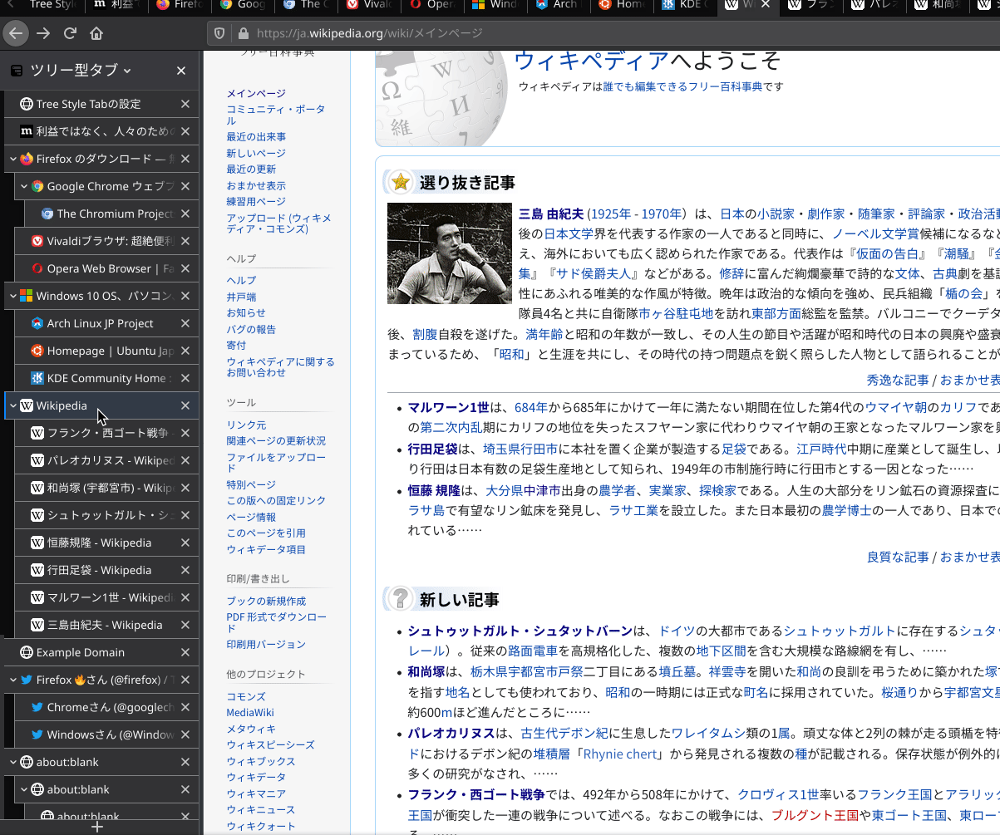

この投稿は [ジャンル無し 全部俺 Advent Calendar 2020](https://adventar.org/calendars/5495) の 17 日目の投稿です。1 日抜かしが多いが、後で埋め合わせの投稿をしたい。

---

タイトルの通り、[Tree Style Tab](https://addons.mozilla.org/ja/firefox/addon/tree-style-tab/) という Firefox 拡張機能に送ったプルリクエストがマージされた。

Tree Style Tab というのはタブをサイドバーに縦にツリー表示することができる拡張機能だ。タブを大量に開く人の強い味方で、かく言う僕もこの拡張機能のヘビーユーザーだ。

Tree Style Tab の特徴の一つに、Tree Style Tab が提供する API を使うことで Tree Style Tab を拡張する拡張機能を開発できることがある。拡張機能をさらに拡張する拡張機能、と何が何やらややこしいようだが、これのお陰で Tree Style Tab はそれ単体を「タブをツリー表示する」という目的を達成するためのシンプルなものに保ちながら、他の拡張機能を導入することによって柔軟に機能を拡張することができる。

そうして開発された Tree Style Tab を拡張する拡張機能の 1 つに[Tree Style Tab Mouse Wheel](https://addons.mozilla.org/ja/firefox/addon/tree-style-tab-mouse-wheel/)というものがある。これは、Tree Style Tab のサイドバー上でマウスホイールを回すことでタブの切り替えを可能にするものだ。僕が以前使っていた[Vivaldi](https://vivaldi.com/ja/)という Chromium ベースのブラウザにはこの機能がビルトインされていて(というか Vivaldi はかなり多数の独自機能とカスタマイズ性を売りにしているブラウザだ)、とても便利だと感じていた。だからこの拡張機能を見つけたときは Tree Style Tab の拡張性に感動したし、この拡張機能のお陰で Vivaldi から Firefox に移行する最後の障壁が取り除かれた。

そんなわけで Firefox をメインブラウザとして使い始めて以来ずっと愛用してきた Tree Style Tab と Tree Style Tab Mouse Wheel なのだが、先日 Firefox 84 に更新したら挙動がおかしくなってしまった。本来、Tree Style Tab Mouse Wheel を導入していると、オーバーフローするまでタブを開いた状態でホイールを回してもスクロールせずにタブが切り替わるのだが、この「スクロールしない」という挙動が壊れてしまった。

この GIF はホイールを回してタブを切り替えている様子のキャプチャ映像なのだが、タブを切り替えると同時にサイドバーがスクロールしてしまっていることが分かる。

実は以前、Firefox Nightly を使っているときからこの現象には気付いていたのだけれど、単なるバグだろうと思って、正式リリースまでには直っているだろうと思っていた。ところが、この問題 h は修正されることなく Stable 版の 84 にも降ってきてしまった。

このバグには非常に困ってしまって、でも Tree Style Tab / Tree Style Tab Mouse Wheel のリポジトリでも言及されていなかったので、自分で原因を調べることにした。

Firefox で拡張機能のエラーやバグを調べるときには、まず `about:debugging` を利用する。

ここから Tree Style Tab Mouse Wheel の調査をボタンをクリックしツールボックスを起動すると、早速怪しげなエラーが目に飛び込んできた。

> ‘wheel’形式のイベントで ‘passive’ として登録されたリスナからの ‘preventDefault()’ の呼び出しを無視します。 scroll.js:427:8

怪しい...怪しすぎる！

早速 `scroll.js` を確認する。どうやらこのファイルは Tree Style Tab 本体のファイルのようだ。つまり、 Tree Style Tab が提供する API 側に問題があったということなのだろうか? どうやら `event.preventDefault();` というのはデフォルトの挙動を無視するためのメソッド[らしい](https://developer.mozilla.org/ja/docs/Web/API/Event/preventDefault)。つまりこのメソッドの呼び出しに失敗していたせいでデフォルトの挙動、つまりスクロールが発生してしまったということだろう。

また、エラーメッセージには `passive` として登録されたリスナからの `preventDefault()` の呼び出しを無視するとある。`passive` とは何ぞやと調べてみると、どうやら `passive : true` として登録されたイベントリスナは `preventDefault` を呼び出さないことを明示する、ということになるらしい。そのせいで `event.preventDefault()` を呼び出せなかったということだ。どうも Firefox 84 では wheel イベントにおいて `passive : true` がデフォルトになったらしい。 `preventDefault` を呼び出さないことを明示することでブラウザのメインスレッドをブロックしなくなり、スクロール性能の改善につながる[らしい](https://developer.mozilla.org/ja/docs/Web/API/EventTarget/addEventListener#Improving_scrolling_performance_with_passive_listeners)。だが Firefox 84 のリリースノートにはそんな変更は書いてなかったような...僕が見落としているだけかもしれないが。

とにかく、ここまで原因がわかってしまえば修正は非常に簡単だ。Tree Style Tab を clone し、wheel イベントリスナを登録しているコードのオプションに `passive : false` を明示する。ビルドした .xpi ファイルを読み込むと、確かに Tree Style Tab Mouse Wheel が有効だとホイールを回転してもスクロールが発生しない。成功だ。

問題が修正されたことを確認したら、最後にプルリクエストを送信する。今までもドキュメントの修正や翻訳のプルリクエストをしたことはあるが、ソースコードを変更するプルリクエストは初めてだ。たった一行の変更とはいえ、結構緊張する。Tree Style Tab の開発者である [piro](https://twitter.com/piro_or/) 氏も日本語話者なので日本語でプルリクを送ろうかな...と思ったが、リポジトリを見渡す限り英語の海だったので英語で書いた。拙い英語だからちゃんと伝わるか心配だったのだが、数時間後、piro 氏から反応があり、無事僕のプルリクエストはマージされた。それが[これだ](https://github.com/piroor/treestyletab/pull/2784)。

些細なことではあるが、日頃からお世話になっている拡張機能の開発に少しでも貢献できたと思うと嬉しい。ブラウザ備え付けのデバッガーのお陰で原因究明も修正もサクッとできたので、満足感が高い。あと MDN はいつも質の高い情報があってありがたい。

これからも機会があればこういうことをしていきたいと思う。
