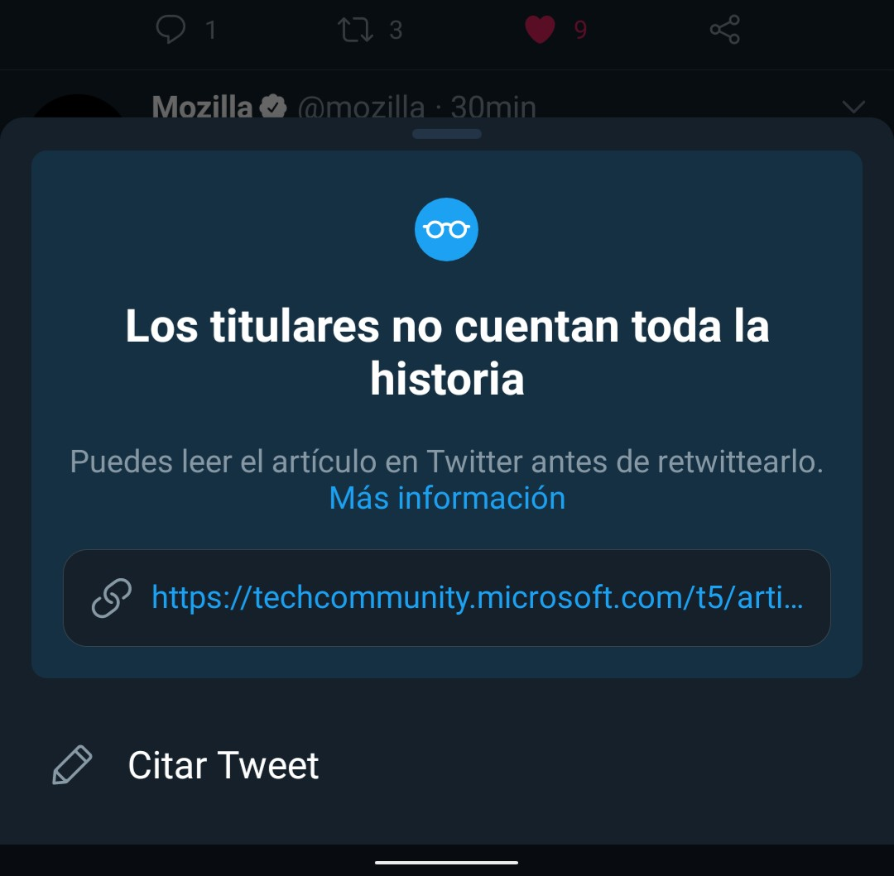

この投稿は [ジャンル無し 全部俺 Advent Calendar 2020](https://adventar.org/calendars/5495) の 18 日目の投稿です。

---

先日、リツイートの仕様が変わった。というか、本来の仕様に戻った。

10月頃から、Twitter でリツイートボタンを押すと引用リツイートのダイアログが表示されるようになった。本来なら通常のリツイートと引用リツイートのどちらかを選択するドロップダウンメニュー(?)が表示されるのだが、アメリカ大統領選挙に向けて、安易なリツイートを抑えるためにこのような変更が導入された。これの賛否は(自分の観測範囲内では)結構大きく別れていて、中には[無理やり元の挙動を再現する Chrome 拡張機能](https://chrome.google.com/webstore/detail/twitterrevertrt/hdmjlgloijaconhgocaijgfghlchmmkn)を書いている人もいた。

僕はというと、この仕様は結構気に入っていた。引用リツイートをするときのタップ数が一つ減るし、「コメントなしなら通常リツイート」という挙動はスマートで良い。マウスの移動距離が多少増えるものの、誤差の範囲内だ。

だが、昨日 Twitter を開いたら、これが元に戻っていることに気付いた。

以前のように、引用リツイートとリツイートが選べるようになっている。大統領選が終わってからも大統領選仕様を続けていたのに、なんでこのタイミングで?と思って調べてみると、この仕様が[思慮深い拡散につながらなかった](https://www.itmedia.co.jp/news/articles/2012/17/news088.html)からやめたと。

確かに、自分も安易なリツイートが減ったかと言われたらそうでもない気がする。kawaii イラストは反射でリツイートしてたし、僕が大統領選仕様を気に入っていたのは引用リツイートをしやすかったからで、通常のリツイートをする前にひと呼吸置いて考える...みたいな変化はなかったと思う。ちょっと残念だけど、目的が達成されなかったのなら仕方ないだろう。どうせこの変更にもすぐ慣れる。

一方で、リツイート前に「元記事読みませんか?」と促す機能は続投されるらしい。この「元記事読みませんか?」、自分のがリツイートをするときにも結構な頻度で表示されていて、ちゃんと読んでないなあ、雑なリツイートをしているなあと再確認させられた。みんなも元記事はちゃんと読もう。[SNS でシェアさせていただきたくなる記事](https://scrapbox.io/shokai/SNS%E3%81%A7%E3%82%B7%E3%82%A7%E3%82%A2%E3%81%95%E3%81%9B%E3%81%A6%E3%81%84%E3%81%9F%E3%81%A0%E3%81%8D%E3%81%9F%E3%81%8F%E3%81%AA%E3%82%8B%E8%A8%98%E4%BA%8B)に惑わされるな。

(ちょっと前のスクリーンショットなのだが、この頃は何故かスマホをスペイン語設定で使っていた)
