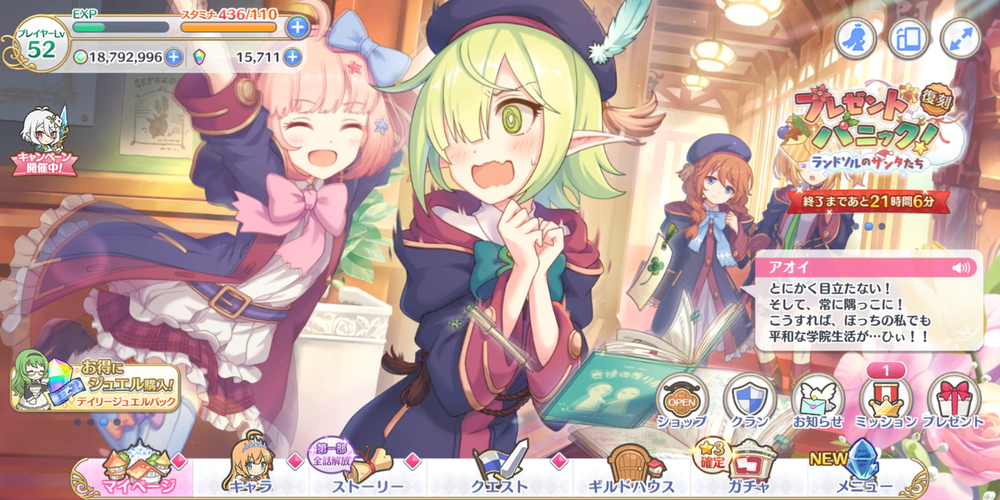
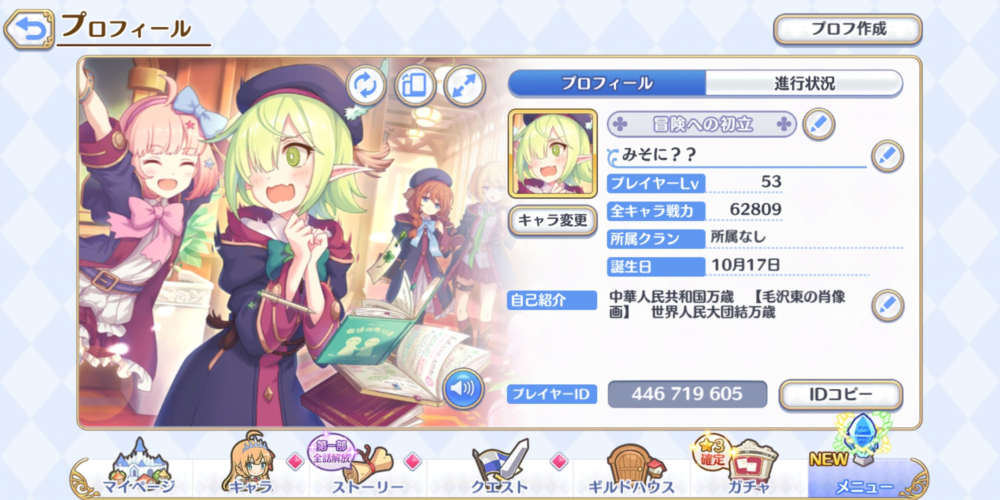

この投稿は [ジャンル無し 全部俺 Advent Calendar 2020](https://adventar.org/calendars/5495) の 22 日目の投稿です。

---

スマホ RPG の超人気作、[プリンセスコネクト！Re:Dive](https://priconne-redive.jp/) のプレイを再開した。

再開した、と言っても別にやり込んでいたわけじゃんくて、無料のガチャを回したり、クエストをちょっとずつ進めている程度。カスタム ROM を焼いたりして遊んでいると度々スマホを初期化することになるので、再インストールが面倒で放置しているというだけだった。テレビで CM を見て、「またちょっとやってみるか」みたいな感じ。このゲームは Google Play Games と連携してデータを動悸しておけるので、いつでも再開できる。

プレイしていて思うのだけれど、やっぱり大人気スマホ RPG というだけあって UI もとても良く作り込まれてるなと感じる。ボタンの配置とか空タップの挙動も分かりやすいし、読み込みがかかる画面遷移が少なくてストレスフリー、しかも 60fps で動いてる。これに慣れると、他のスマホゲームの UI がどれも操作しにくく感じるようになってくる。

システムも良い。僕は未だにシステムをよく理解してないので雰囲気で進めてるのだけれど、このレベルなら雰囲気で進められるぐらいの難易度になってるのはありがたい。初見で「難しい！」となって離脱してしまわないようになっている。長々とチュートリアルで解説するよりもこういう感じのほうがいいと思う。戦闘もオートにお任せだし、ゲームを続けることが負担にならないようによく考えられている。

キャラは言わずもがなかわいい。うん。SD キャラがぴょこぴょこ、ヌルヌル動いているのを見ているだけで時間を潰せる。

一つ笑ってしまったのが、珍しく自己紹介欄の NG ワードがかなり緩いということ。「[中華人民共和国万歳　【毛沢東の肖像画】　世界人民大団結万歳](https://commons.wikimedia.org/wiki/File:Tiananmen_beijing_Panorama.jpg)」と入力したら普通に通ってしまって拍子抜け。色々試してみたら「右翼・左翼」はブロックされたのだけれど「全体主義」とか「トロツキスト」あたりはお咎めなし。BFV でエンブレムがなくなったり、最近のゲームは結構こういう場所の自由が利かないイメージがあったので意外だった。ただ通報されて運営の人力チェックが入ったらどうなるか分からないので自己責任で。

