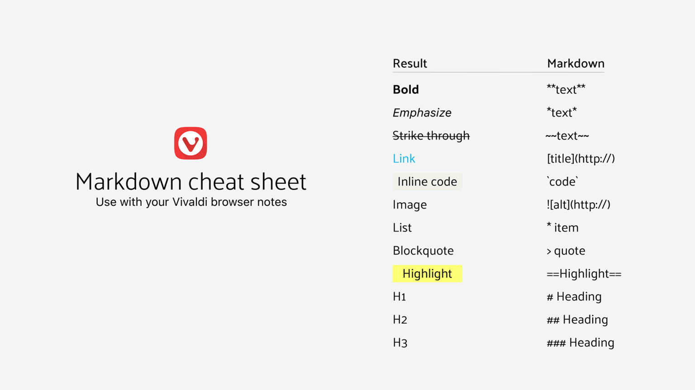

気が触れたので、ブログを作った。これがそのブログである。

静的サイトジェネレーターに Gatsby を使っており、爆速で動き、ページ遷移の際の再レンダリングは最小限に抑えられ、Markdown 形式で書かれた記事をコミットしたら GitHub Actions で自動でビルドしてくれる。最近流行っている「イケてるブログ」だ。始めのうちはいっそ HTML を直打ちして 90 年台を彷彿とさせるブログでも作ってやろうかと思っていたのだが、巷に便利なツールが溢れているのを見るとそれも面倒に思えて、また少しでも自分の貧相な技術力の足しになればと思い「イケイケな技術」を使った「イケてるブログ」を作ることと相成った。`gatsby-starter-blog`という雛形を流用したこともあり案外簡単だった。ナウい人間が作ったヤングなツールは物事を簡素化してくれるようだ...少なくとも今のところは。因みにデザインがイケていないのは制作者である私のデザインセンスに起因する。未完成な部分も多々ある。というか何もかも未完成な状態のまま公開のみを急いだので、これから沢山修正していくことになるだろう。とりあえず、カテゴリとタグ、それにサイドバーを追加する予定だ。まあ、こんなブログを見に来る人が居るとも思えないし、それらは全て私の自己満足のためのオナニーでしか在り得ないだろう。

ところで、ブログを作ろうと決めたは良いものの何を書こうかということは結構悩んだ。技術ブログを書くにはあまりに初心者だし、所謂「文章」を書く程の文才があるわけでもない。ブログを作った理由が「ブログを作りたかったから」なので、特に書きたい事があるわけでは無いのだ。

なので、このブログは特にテーマを決めることはせず、怪文書を主体として私が書きたいことを適当に書き連ねるという運用をされることになるだろう。勿論、時たま技術的な内容を書くこともあるかも知れないし、急に政治的スタンスを全面に押し出した右とも左ともつかない気持ち悪いブログになるかも知れない。そういう時は、そっとタブを閉じて、Twitter で私に文句を言い、ブロックすればいい。インターネットは誰にとっても自由だ。

このブログは Markdown で記事を書けるようになっているのだが、私は今まで一度も Markdown を書いたことが無い。当分はこの[Vivaldi](https://vivaldi.com)が作ったお洒落な Markdown チートシートを見ながら、ゆっくりと書くことになるだろう。正直なところ、Markdown はあまり書きやすい記法ではないように思える。[Scrapbox](https://scrapbox.io/)記法ほど直感的な訳でもないし、HTML と比べて書く必要がある文字数が少し減るだけだ。まあ、慣れてしまえばそんなことも感じなくなるのだろうが。

何はともあれ、三日坊主にならないよう願いつつゆっくりと続けていこうと思う。可能であれば隔週更新を目指す。では。
